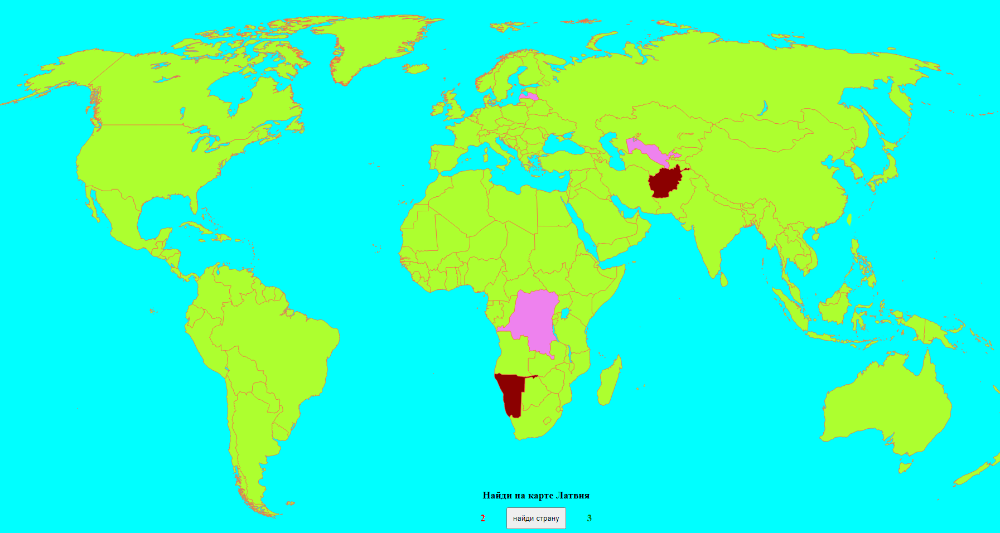

# map-game

| Deadline         | Folder name | Branch name |
| ---------------- | ----------- | ----------- |
| 25.03.2020 23:59 | map-game    | map-game   |

## Task  Map-game

Map-game - Небольшая игра на знание географии. При нажатии на кнопку звучит (а так же выводится на экран) название страны. Пользователь должен мышкой кликнуть на карте на страну. В случае правильного ответа - территория страны закрашивается одним цветом, в случае не правильного - другим. Реализован ховер-эффект при наведении мышкой на страну, так же ведется подсчет количества правильных и не правильных ответов. Игра может быть реализована на русском, английском, белорусском или украинском. Дизайн на ваше усмотрение.

- Видео: тут будет ссылка
- Код: тут будет ссылка
- Demo: тут будет ссылка

## Критерии оценки

**Максимальный балл за задание +50**

Базовый функционал:

Basic scope:
  - воспроизводится функциональность исходного проекта: выводится на экран просьба показать страну, по стране на карте можно кликнуть и в случае правильного ответа вся территория страны закрашивается одним цветом, в случае не правильного - другим цветом.
- В момент начала игры на экране есть кнопка "PLAY", после нажатия на которую начинается игра, а надпись на кнопке меняется на "find" (Допустимо использовать другие понятные по смыслу слова или иконки)
- На экран выводится количество правильных и не правильных ответов.
- В игре участвуют 100 самых больших по площади стран.
- Первый варианта задавания вопроса - по клику на кнопку "find" на экран выводится соответсвующая надпись на экране.
- есть футер со ссылкой на рсскул и на гитхаб автора работы.
- дизайн на усмотрение автора. Адаптивность - работа проверятся при ширине экрана свыше 1024 пикселей. Карта должна быть на весь экран. (исключение футер - он может быть как отдельным визуальным элементом, так и быть поверх основной карты)

Advanced scope:
- На экран выводятся иконки дублирующие количество правильных и не правильных ответов.
- В одной сессии игры нужно показать 15 случайных стран.При следующем запуске, или перезагрузке приложения, список стран обновляется.
- После клика по стране - карта блокируется и нажимать на страны нельзя до тех пор пока не будет задан следующий вопрос.
- Второй вариант задавания вопроса - через задержку 1-2 секунды звучит аудио с названием искомой страны (или при нажатии на кнопку "find") и соответсвующая надпись на экране.
- Если пользователь не выбрал страну, он может нажать find - будет предложена следующая страна для поиска, а пропущенная будет засчитана как не правильный ответ.

  
Hacker scope:
  - Есть озвучка игры - произносится какая страна должна быть найдена, есть звуки ошибки и правильного ответа, есть звуки на итоговый результат - минимум 3 разные - для пятерки, для двойки, и для трех-четырех.
  - после окончания игры всплывает попап с оценкой: угадано 0-7 стран - ваша оценка 2, угадано 8-10 стран - ваша оценка 3, угадано 11-13 стран - ваша оценка 4, угадано 14-15 стран - молодец! Пять! (надписи могут быть другие, оформление на ваш вкус - но смысл должен сохраниться)
  - после закрытия попапа (крестик, нажатие кнопки "esc" и/или клик вне попапа) - игра начинается с начала, с новым случайным набором стран.
  

  
  
 
  

  
  

  - 
  
## Instruction to cross-check

  
## Материалы

## Примеры кода

## API с цитатами

Документ для вопросов:

## Cross-check

- инструкция по проведению cross-check: https://docs.rs.school/#/cross-check-flow
- форма для проверки задания: 
- ссылки на лучшие работы добавьте, пожалуйста, в эту форму 
